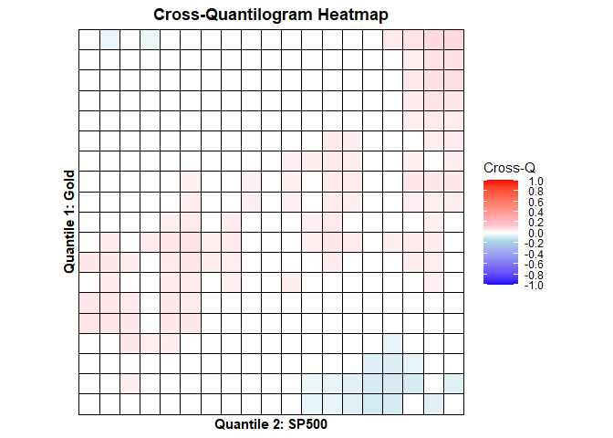
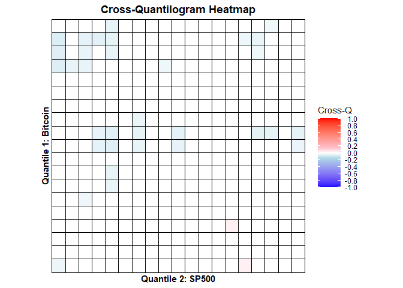

<!-- README.md is generated from README.Rmd. Please edit that file -->

# Hedge and Safe Haven testning

The package/repo is developed to test hedge and safe haven hypotheses
(Baur and McDermott, 2010), estimate the hedge ratio, hedge
effectiveness, and optimal portfolio weights (Basher and Sadorsky,
2016), cross-quantilogram-based predictability (Han et al., 2016) and
the conditional diversification benefits (Christoffersen et al., 2012;
2018).

## 📦 Package Includes

- **`hedge_safehaven_bm10()`**  
  Implements the Baur & McDermott (2010) regression-based framework for
  identifying hedge and safe-haven properties.

- **`classify_bm10()`**  
  Classifies an asset as a strong or weak hedge, or as a strong/weak
  safe haven, based on the estimated coefficients from
  `hedge_safehaven_bm10()`.

- **`hedge_effectiveness_dcc()`**  
  Estimates time-varying hedge ratios, conditional hedge effectiveness,
  and optimal hedge weights using an asymmetric DCC–GJR–GARCH model.

- **`cdb()`**  
  Computes the Christoffersen–Diebold–Bakshi (CDB) diversification
  benefit for two-asset portfolios at different portfolio weights.

- **`hedgedata`**  
  Daily log returns of the **S&P 500**, **Bitcoin**, and **Gold**
  (sourced from Yahoo Finance); used for hedge and safe-haven
  illustrations.

## Installation

``` r
# install.packages("devtools")
devtools::install_github("https://github.com/syedjawadshahzad/HedgeSafeHaven")
library(HedgeSafeHaven)   
```

## Background & Motivation

The role of assets such as **gold** and **bitcoin** as potential hedges
or safe havens for equity markets has attracted increasing scholarly
attention (Ali et al., 2020; Shahzad et al., 2019, 2020; Mujtaba et al.,
2024) amid heightened global economic uncertainty, persistent
inflationary pressures, and evolving monetary policy regimes.

## Market Context (as of late 2025)

- **Gold** has surged to record highs above **\$4,000 per ounce**,
  driven by central-bank purchases and portfolio diversification away
  from fiat currencies.  
  ([BeInCrypto,
  2025](https://beincrypto.com/gold-all-time-high-bitcoin-rally/?utm_source=chatgpt.com))
- **Bitcoin** climbed above **\$110,000** amid U.S. dollar weakness and
  renewed “digital-gold” narratives.  
  ([Forbes,
  2025](https://www.forbes.com/sites/digital-assets/2025/10/07/serious-us-dollar-fed-warning-triggers-sudden-bitcoin-and-gold-all-time-high-price-surge/?utm_source=chatgpt.com))
- Short-term divergences have appeared — gold rallies while bitcoin
  retreats — highlighting their differing safe-haven mechanisms.  
  ([CoinDesk,
  2025](https://www.coindesk.com/markets/2025/09/22/gold-rallies-an-hour-after-bitcoin-drops-suggesting-a-profit-rotation-into-metals?utm_source=chatgpt.com))

The **HedgeSafeHaven** package provides econometric tools to quantify
such behaviors using **GARCH–DCC**, **regression-based safe-haven
models**, **cross-quantile dependence**, and **conditional
diversification benefits (CDB)**.

------------------------------------------------------------------------

## Example Workflow — Gold and Bitcoin

We illustrate how to use **gold (GLD)** and **bitcoin (BTC)** as
potential hedges or safe havens for the **U.S. stock market (S&P 500)**.

### 1️⃣ Hedge / Safe-Haven Classification

``` r
# Regression-based hedge/safe-haven estimation
# SP500 and Gold
data("hedgedata")
res_gld <- hedge_safehaven_bm10(hedgedata$SP, hedgedata$GLD)
print(res_gld)
```

    ##   Hedge Coefficient_Sum    p_value
    ## 1    c0      0.04988263 0.06089549
    ## 2  0.10     -0.07209026 0.27142322
    ## 3  0.05     -0.11405518 0.01072091
    ## 4  0.01      0.03023066 0.56524296

``` r
# SP500 and Gold
res_btc <- hedge_safehaven_bm10(hedgedata$SP, hedgedata$BTC)
print(res_btc)
```

    ##   Hedge Coefficient_Sum      p_value
    ## 1    c0       0.8844556 3.060991e-20
    ## 2  0.10       0.4617737 3.194434e-02
    ## 3  0.05       1.1166908 1.300167e-12
    ## 4  0.01       1.5372902 5.973991e-30

``` r
# Classification
classify_bm10(res_gld)
```

    ## [1] "Selected asset is a not a hedge - safe haven for 5% ."

``` r
classify_bm10(res_btc)
```

    ## [1] "Selected asset is a not a hedge - not a safe haven ."

This classifies gold/bitcoin role as a hedge or safe haven relative to
sp500 using the Baur–McDermott (2010) approach.

### 2️⃣ Hedge Effectiveness via DCC

``` r
# Hedging asset: Gold
res_gld <- hedge_effectiveness_dcc(hedgedata$SP, hedgedata$GLD)
print(res_gld)
```

    ##    beta_mean   beta_min beta_max         HE       OPW
    ## 1 0.01634998 -0.8941619 1.532328 0.03604662 0.4852705

``` r
# Hedged asset: Bitcoin, 
res_btc <- hedge_effectiveness_dcc(hedgedata$SP, hedgedata$BTC)
print(res_btc)
```

    ##    beta_mean    beta_min  beta_max        HE        OPW
    ## 1 0.06999591 -0.01849912 0.4599944 0.1095714 0.03016472

### 3️⃣ Cross-Quantile Dependence Heatmaps

``` r
## Install the 'quantilogram' library
# install.packages("quantilogram") 
library(quantilogram)
# Use gold (GLD) as predicted variable, S&P (SP) as predicting variable
df1 <- hedgedata[, c("GLD", "SP")]
## setup and estimation 
k = 1                             ## lag order 
vec.q  = seq(0.05, 0.95, 0.05)    ## a list of quantiles 
B.size = 100                      ## Repetition of bootstrap  
res1 = crossq.heatmap(df1, k, vec.q, B.size, var1_name = "Gold", var2_name = "SP500") 

## result 
print(res1$plot)
```

<!-- -->

``` r
# Use bitcoin (BTC) as predicted variable, S&P (SP) as predicting variable
df2 <- hedgedata[, c("BTC", "SP")]
res2 = crossq.heatmap(df2, k, vec.q, B.size, var1_name = "Bitcoin", var2_name = "SP500") 

## result 
print(res2$plot)
```

<!-- -->

These heatmaps visualize how dependence across quantiles changes from
S&P 500 to gold and bitcoin — revealing whether gold/bitcoin remains
uncorrelated or negatively correlated (safe haven) during market stress.

### 4️⃣ Conditional Diversification Benefit (CDB)

``` r
# Compute CDB for SP500–Gold portfolio at 5% tail
res_cdb1 <- cdb(hedgedata$SP, hedgedata$GLD, p = 0.05)
print(res_cdb1)
```

    ##            w05       w10       w20
    ## [1,] 0.2285815 0.3747956 0.5442972

``` r
# Compute CDB for SP500–Bitcoin portfolio at 5% tail
res_cdb2 <- cdb(hedgedata$SP, hedgedata$BTC, p = 0.05)
print(res_cdb2)
```

    ##             w05       w10       w20
    ## [1,] 0.06954154 0.1352266 0.2559137

This returns a 1×3 matrix of CDB values for portfolio weights of 5%,
10%, and 20% in the hedging asset (gold/bitcoin). Higher CDB values
imply stronger diversification benefits w.r.t weights.

## References

- Ali, S., Bouri, E., Czudaj, R. L., & Shahzad, S. J. H. (2020).
  *Revisiting the valuable roles of commodities for international stock
  markets.* Resources Policy, 66, 101603.
- Basher, S. A., & Sadorsky, P. (2016).
- Hedging emerging market stock prices with oil, gold, VIX, and bonds: A
  comparison between DCC, ADCC and GO-GARCH.\* Energy Economics, 54,
  235–247. Baur, D. G., & McDermott, T. K. (2010). *Is gold a safe
  haven? International evidence.* Journal of Banking & Finance, 34(8),
  1886-1898.
- Christoffersen, P., Errunza, V., Jacobs, K., & Langlois, H. (2012).
  *Is the potential for international diversification disappearing? A
  dynamic copula approach.* The Review of Financial Studies, 25(12),
  3711-3751.
- Christoffersen, P., Jacobs, K., Jin, X., & Langlois, H. (2018).
  *Dynamic dependence and diversification in corporate credit.* Review
  of Finance, 22(2), 521-560.
- Mujtaba, G., Siddique, A., Naifar, N., & Shahzad, S. J. H. (2024).
  *Hedge and safe haven role of commodities for the US and Chinese
  equity markets.* International Journal of Finance & Economics, 29(2),
  2381–2414.
- Shahzad, S. J. H., Bouri, E., Roubaud, D., & Kristoufek, L. (2020).
  *Safe haven, hedge and diversification for G7 stock markets: Gold
  versus bitcoin.* Economic Modelling, 87, 212–224.
- Shahzad, S. J. H., Bouri, E., Roubaud, D., Kristoufek, L., & Lucey, B.
  (2019). *Is Bitcoin a better safe-haven investment than gold and
  commodities?.* International Review of Financial Analysis, 63,
  322-330.
